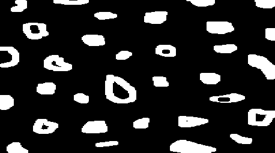
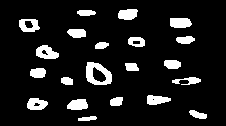
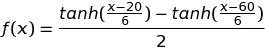

## Digital Image Processing

This website is a showcase of small projects developed during the course of Digital Image Processing offered by Universidade Federal do Rio Grande do Norte, Department of Computer Engineering.

These exercises are based on the OpenCV tutorial provided by professor Agostinho Brito Jr (http://agostinhobritojr.github.io/tutoriais/pdi/). 

OpenCV 2.4 has been used in this material.

### Negative of a region


This is a typical "getting started" example to OpenCV, because it uses simple pixel manipulation in order to make a negative effect in a region of the given image.

To invert the color of a pixel, the formula used is `color = 255 - color` in each channel. To run this example: `./regions <img_path> <x1> <y1> <x2> <y2>` where x1, y1, x2 and y2 the rectangular area to be turned into negative.

#### regions.cpp
```c++
#include <iostream>
#include <cstdlib>
#include <opencv2/opencv.hpp>

using namespace cv;
using namespace std;

#define CHECK_VALID_RANGE(x, dimension) if(x < 0 || x >= dimension) \
    {cout << "Invalid value for "#x << endl; exit(1);}

int main(int argc, char** argv){
    if (argc != 2 && argc != 6) {
        cout << "usage: " << endl
             << "\t" << argv[0] << "<img_path>" 
             << " // To get image dimensions" << endl
             << "\t" << argv[0] << "<img_path> <x1> <y1> <x2> <y2>" 
             << " // To negative the rectangular area" << endl;

        exit(1);
    }
    
    Mat image = imread(argv[1], CV_LOAD_IMAGE_COLOR);
    
    if (!image.data)
        cout << "Could not open " << argv[1] << endl;

    int cols = image.cols;
    int rows = image.rows;

    cout << "###### Image dimensions ######" << endl
         << "Columns: "  << cols << endl
         << "Rows: "     << rows << endl
         << "##############################" << endl;

    if (argc == 2) exit(0);

    int x1 = atoi(argv[2]); CHECK_VALID_RANGE(x1, rows);
    int y1 = atoi(argv[3]); CHECK_VALID_RANGE(y1, cols);
    int x2 = atoi(argv[4]); CHECK_VALID_RANGE(x2, rows);
    int y2 = atoi(argv[5]); CHECK_VALID_RANGE(y2, cols);

    namedWindow(argv[1],WINDOW_AUTOSIZE);

    for (int i = min(x1, x2); i < max(x1, x2); ++i) {
        for (int j = min(y1, y2); j < max(y1, y2); ++j) {
            image.at<Vec3b>(i,j)[0] = 255- image.at<Vec3b>(i,j)[0];
            image.at<Vec3b>(i,j)[1] = 255- image.at<Vec3b>(i,j)[1];
            image.at<Vec3b>(i,j)[2] = 255- image.at<Vec3b>(i,j)[2];
        }
    }

    imshow(argv[1], image);  
    waitKey();

    exit(0);
}

```

### Swapping regions

This example consists of swapping the four regions of a picture, given a order passed by command line. For example, running `./swap_regions lenna.png 4 3 2 1` swaps the regions as follows, since the original sequence is `1 2 3 4` (left to right, top to bottom)


#### swap\_regions.cpp
```c++
#include <iostream>
#include <cstdlib>
#include <opencv2/opencv.hpp>

using namespace cv;
using namespace std;

#define CHECK_VALID_RANGE(x) if (x < 0 || x > 3) \
    {cout << "Invalid region number in sequence" << endl; exit(1);}

int main(int argc, char** argv){
    if (argc != 6) {
        cout << "usage: " << endl
             << "\t" << argv[0] << " <img_path> <sequence with 4 numbers from 1 to 4" 
             << " separated by spaces>" << endl
             << "\tExample: " << argv[0] << " ../img/lenna.png 4 3 2 1" << endl
             << "\tThe sequence 1 2 3 4 is the original image, swapping these numbers" 
             << " swaps the four regions of the image." << endl;

        exit(1);
    }
    
    Mat image = imread(argv[1], CV_LOAD_IMAGE_COLOR);
    
    if (!image.data)
        cout << "Could not open " << argv[1] << endl;

    int sequence[4];
    for (int i = 0; i < 4; ++i) {
        sequence[i] = atoi(argv[i+2]) - 1;
        CHECK_VALID_RANGE(sequence[i]);
    }

    int rows = image.rows;
    int cols = image.cols;

    Rect rois[4] = {
        Rect(     0,      0, rows/2, cols/2),
        Rect(rows/2,      0, rows/2, cols/2),
        Rect(     0, cols/2, rows/2, cols/2),
        Rect(rows/2, cols/2, rows/2, cols/2)
    };

    namedWindow(argv[1],WINDOW_AUTOSIZE);

    Mat3b swapped (rows, cols, Vec3b(0, 0, 0));

    for (int i = 0; i < 4; ++i) {
        Mat region (image, rois[ sequence[i] ]);
        region.copyTo(swapped(rois[i]));
    }

    imshow(argv[1], swapped);  
    waitKey();

    exit(0);
}

```

### Counting bubbles with holes

This example makes use of `floodFill`, which consists of painting an area that has the same color, replacing it by another color. Here this technique is used for counting and labeling bubbles in a black and white picture. Besides that, in this algorithm, bubbles with holes are counted too.

Original image                                   | 
:-----------------------------------------------:|
 |

No boundaries                                              | 
:---------------------------------------------------------:|
  |

Labeled                                         |
:----------------------------------------------:|
  |


To run the program: `./bubbles <bubbles_img>`. An example is illustrated above with an example as input. First we remove the bubbles that are in the boundaries because we can't know for sure that they have holes or not (in case this picture was taken from real objects), then we paint the bubbles and bubbles with holes are paint as blue (in RGB: 0, 0, 255).

One important aspect of the algorith below is that it runs on a BGR image, not greyscale. This is done to overcome the problem of having a limit of 255 bubbles on counting if the same thing was done in greyscale. In this implementation I allowed from BGR = (0,0,1) up until BGR = (50,255,255) for labeling. This way it is possible to count up to 3276799 bubbles. The blue channel was limited to 50 for allowing bubbles with holes to be painted full blue BGR = (255,0,0) and be distinguished from the others.

#### bubbles.cpp
```c++
#include <iostream>
#include <cstdlib>
#include <opencv2/opencv.hpp>

using namespace cv;
using namespace std;

inline void incrementColor(Vec3b &color) {
    if (color[2] < 255) {
        color[2]++;
    } else if (color[1] < 255) {
        color[1]++;
        color[2] = 0;
    } else if (color[0] < 50) {
        color[0]++;
        color[1] = 0;
        color[2] = 0;
    } else {
        cout << "Max of bubbles for this algorithm is 3276799." << endl;
        exit(1);
    }
}

int main(int argc, char** argv){
    if (argc != 2) {
        cout << "usage:" << argv[0] << " <bubbles_image>" << endl
             << "\t where <bubbles_image> should be a black "
             << "and white image of bubbles" << endl;
        exit(1);
    }

    Mat image;

    image = imread(argv[1]);
    if(!image.data) {
        cout << "failed to open bolhas.png" << endl;
        exit(1);
    }

    namedWindow("Original", WINDOW_AUTOSIZE);
    imshow("Original", image);

    Size imgSize = image.size();
    Vec3b white;
    white[0] = 255; white[1] = 255; white[2] = 255;

    // First remove the bubbles in boundaries

    // Loop through first and last line
    for(int i = 0; i < imgSize.width; ++i) {
        // First line
        if (image.at<Vec3b>(0, i) == white) {
            floodFill(image, Point(i, 0), Scalar(0, 0, 0));
        }
        // Last line
        if (image.at<Vec3b>(imgSize.height-1, i) == white) {
            floodFill(image, Point(i, imgSize.height-1), Scalar(0, 0, 0));
        }
    }

    // Loop through first and last column
    for(int i = 0; i < imgSize.height; ++i) {
        // First column
        if (image.at<Vec3b>(i, 0) == white) {
            floodFill(image, Point(0, i), Scalar(0, 0, 0));
        }
        // Last column
        if (image.at<Vec3b>(i, imgSize.width-1) == white) {
            floodFill(image, Point(imgSize.width-1, i), Scalar(0, 0, 0));
        }
    }

    namedWindow("noBoundaries", WINDOW_AUTOSIZE);
    imshow("noBoundaries", image);  
    
    // Then first count bubbles with holes or not
    unsigned num_bubbles = 0;
    // Initial count color is [0,0,1]
    Vec3b color;
    color[0] = 0; color[1] = 0; color[2] = 1;

    for (int i = 0; i < imgSize.height; ++i) {
        for (int j = 0; j < imgSize.width; ++j) {
            if (image.at<Vec3b>(i, j) == white) {
                floodFill(image, Point(j, i), 
                          Scalar(color[0], color[1], color[2]));
                num_bubbles++;
                incrementColor(color);
            }
        }
    }

    cout << "Number of bubbles = " << num_bubbles << endl;

    // Now count bubbles with holes
    
    unsigned num_bubbles_with_holes = 0;
    Mat image_aux = image.clone();

    color[0] = 0; color[1] = 0; color[2] = 1;

    for (int i = 0; i < num_bubbles; ++i) {
        unsigned num_pixels_bg_before = 
            floodFill(image_aux, Point(0, 0), Scalar(0, 0, 0));
        
        Point first_pixel_with_color (0, 0);

        for (int i2 = 0; i2 < imgSize.height; ++i2) {
            for (int j = 0; j < imgSize.width; ++j) {
                if (image_aux.at<Vec3b>(i2, j) == color) {
                    first_pixel_with_color = Point(j, i2);
                    break;
                }
            }
        }
        if (first_pixel_with_color.x == 0 &&
            first_pixel_with_color.y == 0) {
            cerr << "No pixel with this color found. Review algorithm." << endl;
            exit(1);
        }

        unsigned num_pixels_with_color = 
            floodFill(image_aux, first_pixel_with_color, 
                                 Scalar(0, 0, 0));

        unsigned num_pixels_bg_after = 
            floodFill(image_aux, Point(0, 0), Scalar(0, 0, 0));

        if (num_pixels_bg_after > num_pixels_bg_before + num_pixels_with_color) {
            num_bubbles_with_holes++;
            floodFill(image, first_pixel_with_color,
                      Scalar(255, 0, 0));
        } else {
            floodFill(image, first_pixel_with_color,
                      Scalar(rand()%51, rand()%256, rand()%256));
        }

        incrementColor(color);
    }

    namedWindow("colored", WINDOW_AUTOSIZE);
    imshow("colored", image);

    cout << "Number of bubbles with holes = " << num_bubbles_with_holes << endl;

    waitKey();
    
    return 0;
}

```

### Histogram equalization

Here the histogram equalization algorithm is used with the normalized accumulated histogram to update the pixels intensity. With this algorithm, the pixel with highest intensity is going to assume the value of 255 and the others pixel also change accordingly.


#### equalize.cpp
```c++
#include <iostream>
#include <cstdlib>
#include <opencv2/opencv.hpp>

using namespace cv;
using namespace std;

int main(int argc, char** argv){
    Mat image, grey;
    int width, height;
    VideoCapture cap;

    int histSize = 256;
    float range[] = {0, 256};
    const float* histRange = {range};
    Mat hist;

    cap.open(0);

    if (!cap.isOpened()){
        cout << "No cameras available" << endl;
        exit(1);
    }

    width  = cap.get(CV_CAP_PROP_FRAME_WIDTH);
    height = cap.get(CV_CAP_PROP_FRAME_HEIGHT);
    
    cout << "###### Image dimensions ######" << endl    
         << "Width = " << width << endl
         << "Height  = " << height << endl
         << "##############################" << endl;

    namedWindow("grey", WINDOW_NORMAL);
    namedWindow("equalized", WINDOW_NORMAL);

    while (1) {
        cap >> image;
        if(image.empty()) exit(1);

        cvtColor(image, grey, CV_BGR2GRAY);

        imshow("grey", grey);

        calcHist(&grey, 1, 0, Mat(), hist, 1, &histSize, &histRange);
        
        // Calculate accumulated histogram
        for (int i = 1; i < hist.rows; ++i) {
            hist.at<float>(i) += hist.at<float>(i-1);
        }
        
        // Normalize the accumulated histogram
        for (int i = 0; i < hist.rows; ++i) {
            hist.at<float>(i) *= 255/((float)(width*height));
        }

        // Repaint the new equalized image
        for (int i = 0; i < height; i++) {
            for (int j = 0; j < width; j++) {
                grey.at<uchar>(i, j) = (uchar) hist.at<float>(grey.at<uchar>(i, j));
            }
        }

        imshow("equalized", grey);
    
        if(waitKey(30) >= 0) break;
    }
    exit(0);
}

```

### Motion detection

Motion detection can also be achieved through the use of histograms. In this example, the average intensities of consecutive histograms are compared in order to determine if there was some movement in the camera stream.


This program can be run by `./motiondetector <threshold>`, where `<threshold>` is the relative difference to consider a moviment (value from 0 to 100). A delay of 1 second is put between each frame, because in case a too short interval was used, the difference between frames would be too little and the algorithm would not detect.

In a surveilance system, the ideal I think would be to compare frames with a background frame (empty scene) in order to determine suspecius activity with a high frame rate.

#### motiondetector.cpp
```c++
#include <iostream>
#include <cstdlib>
#include <opencv2/opencv.hpp>

using namespace cv;
using namespace std;

int main(int argc, char** argv){
    if (argc != 2) {
        cout << "usage: " << argv[0] << " <thresh_motion>" << endl
             << "Where thresh_motion is a threshold for "
             << "relative difference of histograms between 0 and 100." << endl;
        exit(1);
    }

    float thresh_motion = atof(argv[1]);

    Mat image, grey;
    int width, height;
    VideoCapture cap;

    int histSize = 256;
    float range[] = {0, 256};
    const float* histRange = {range};
    Mat hist;

    float avg = -1, prev_avg = -1;

    cap.open(0);

    if (!cap.isOpened()){
        cout << "No cameras available" << endl;
        exit(1);
    }

    width  = cap.get(CV_CAP_PROP_FRAME_WIDTH);
    height = cap.get(CV_CAP_PROP_FRAME_HEIGHT);
    
    cout << "###### Image dimensions ######" << endl    
         << "Width = " << width << endl
         << "Height  = " << height << endl
         << "##############################" << endl;

    namedWindow("grey", WINDOW_NORMAL);

    while (1) {
        cap >> image;
        if(image.empty()) exit(1);

        cvtColor(image, grey, CV_BGR2GRAY);

        calcHist(&grey, 1, 0, Mat(), hist, 1, &histSize, &histRange);

        avg = 0;
        for (int i = 0; i < 256; ++i) {
            avg += i * hist.at<float>(i) / ( (float)(width*height) );
        }

        if (prev_avg > 0 && // First iteration and not zero for division
            abs(avg-prev_avg)/prev_avg > thresh_motion/100.0 ) {

            cout << "Detected movement!!" << endl;
        }

        prev_avg = avg;
    
        imshow("grey", grey);
        
        if(waitKey(1000) >= 0) break;
    }
    exit(0);
}

```

### Laplacian of Gaussian

Here is a comparation between the application of a Laplacian filter and the Laplacian of Gaussian. In order to obtain the Laplacian of Gaussian, the convolution of the two 3x3 kernels was calculated previously, which results in a 5x5 kernel. For this, a simple multiplication in Python with Scipy helped:

```python
import numpy as np
from scipy import signal

gauss = np.array([[1,2,1],[2,4,2],[1,2,1]])
laplacian = np.array([[0,-1,0],[-1,4,-1],[0,-1,0]])

signal.convolve2d(laplacian, gauss)

# Result:
# [[ 0, -1, -2, -1,  0],
#  [-1,  0,  2,  0, -1]
#  [-2,  2,  8,  2, -2],
#  [-1,  0,  2,  0, -1]
#  [ 0, -1, -2, -1,  0]]

```


It is possible to notice that the borders now have a higher intensity, although more noise seems to show up with the Laplacian of Gaussian. It seems that due to the webcam pepper and salt noise, the gaussian filter does not help to cut it off, but rather increase its intensity.

#### laplgauss.cpp
```c++
#include <iostream>
#include <opencv2/opencv.hpp>

using namespace cv;
using namespace std;

void printmask(Mat &m){
    for(int i=0; i<m.size().height; i++){
        for(int j=0; j<m.size().width; j++){
            cout << m.at<float>(i,j) << ",";
        }
        cout << endl;
    }
}

void menu(){
    cout << "\npress key to activate filter: " << endl
         << "a - absolute value" << endl
         << "m - average" << endl
         << "g - gauss" << endl
         << "v - vertical" << endl
         << "h - horizontal" << endl
         << "l - laplacian" << endl
         << "x - laplacian of gaussian" << endl
         << "esc - exit" << endl;
}

int main(int argvc, char** argv){
    VideoCapture video;
    float media[] = {1,1,1,
                     1,1,1,
                     1,1,1};
    
    float gauss[] = {1,2,1,
                     2,4,2,
                     1,2,1};
    
    float horizontal[]={-1,0,1,
                        -2,0,2,
                        -1,0,1};
    
    float vertical[]={-1,-2,-1,
                       0,0,0,
                       1,2,1};
    
    float laplacian[]={0,-1,0,
                      -1,4,-1,
                       0,-1,0};

    float laplacian_of_gaussian[] = {0,-1,-2,-1,0,
                                     -1,0,2,0,-1,
                                     -2,2,8,2,-2,
                                     -1,0,2,0,-1,
                                     0,-1,-2,-1,0};

    Mat cap, frame, frame32f, frameFiltered;
    Mat mask(3,3,CV_32F), mask1;
    Mat result, result1;
    double width, height, min, max;
    int absolut;
    char key;

    video.open(0); 
    if(!video.isOpened()) 
        return -1;

    width=video.get(CV_CAP_PROP_FRAME_WIDTH);
    height=video.get(CV_CAP_PROP_FRAME_HEIGHT);

    cout << "width=" << width << "\n";;
    cout << "height =" << height<< "\n";;

    namedWindow("original", WINDOW_NORMAL);
    namedWindow("spatialfilter", WINDOW_NORMAL);

    mask = Mat(3, 3, CV_32F, media); 
    scaleAdd(mask, 1/9.0, Mat::zeros(3,3,CV_32F), mask1);
    swap(mask, mask1);
    absolut=1; // calcs abs of the image

    menu();
    for(;;){
        video >> cap; 
        cvtColor(cap, frame, CV_BGR2GRAY);
        flip(frame, frame, 1);
        imshow("original", frame);
        frame.convertTo(frame32f, CV_32F);
        filter2D(frame32f, frameFiltered, frame32f.depth(), mask, Point(1,1), 0);
        if(absolut){
            frameFiltered=abs(frameFiltered);
        }
        frameFiltered.convertTo(result, CV_8U);
        imshow("spatialfilter", result);
        key = (char) waitKey(10);
        if( key == 27 ) break; // esc pressed!
        switch(key){
            case 'a':
                menu();
                absolut=!absolut;
                break;
            case 'm':
                menu();
                mask = Mat(3, 3, CV_32F, media);
                scaleAdd(mask, 1/9.0, Mat::zeros(3,3,CV_32F), mask1);
                mask = mask1;
                printmask(mask);
                break;
            case 'g':
                menu();
                mask = Mat(3, 3, CV_32F, gauss);
                scaleAdd(mask, 1/16.0, Mat::zeros(3,3,CV_32F), mask1);
                mask = mask1;
                printmask(mask);
                break;
            case 'h':
                menu();
                mask = Mat(3, 3, CV_32F, horizontal);
                printmask(mask);
                break;
            case 'v':
                menu();
                mask = Mat(3, 3, CV_32F, vertical);
                printmask(mask);
                break;
            case 'l':
                menu();
                mask = Mat(3, 3, CV_32F, laplacian);
                printmask(mask);
                break;
            case 'x':
                menu();
                mask = Mat(5, 5, CV_32F, laplacian_of_gaussian);
                printmask(mask);
            default:
                break;
        }
    }
    return 0;
}

```

### Tilt Shift

Tilt shifting consists of blurring the boundaries for selective focus, often producing miniature effect. To achieve this, element-wise multiplication is done with masks of hyperbolic tangents vertically. For example,



and two representations of the image: focused and blurred. Afterwards, these two results are added to produce the final image, that has focus on the center and blurred at the boundaries.


The parameters such start of focus, decay and center of focus are controlled using GUI elements of OpenCV. Changing these values reflect in the equation for the vertical brightness of the masks.

To use this program, run `./tiltshift `.

#### tiltshift.cpp
```c++
#include <iostream>
#include <cmath>
#include <opencv2/opencv.hpp>

using namespace cv;
using namespace std;

double start_focus = 20;
int start_focus_slider = 20;
int start_focus_slider_max = 100;

double decay_strength = 100;
int decay_strength_slider = 100;
int decay_strength_slider_max = 100;

double center_focus = 50;
int center_focus_slider = 50;
int center_focus_slider_max = 100;

Mat image, temp_image, blurred_image;
Mat func_image, compl_image;
Mat m_image, m_bimage;
Mat result;

char TrackbarName[50];

void drawFuncImage() {
    uchar pixel_value;
    double x;
    double den = (decay_strength > 0 ? decay_strength/10 : 0.1);
    double func_val;
    for (int i = 0; i < func_image.rows; ++i) {
        x = (double) i*100.0 /func_image.rows;
        func_val =
            ( tanh( (x-start_focus)/den ) - 
              tanh ( ( x-(2*center_focus-start_focus) )/den ) ) / 2;
        pixel_value = (uchar) (255*func_val);
        for (int j = 0; j < func_image.cols; ++j) {
            func_image.at<uchar>(i,j) = pixel_value;
            compl_image.at<uchar>(i,j) = 255 - pixel_value;
        }
    }
    imshow( "func_image",  func_image);
    imshow("compl_image", compl_image);
}

void composeResult() {
    drawFuncImage();
    
    Mat image_f, blurred_image_f;
    image.convertTo(image_f, CV_32F);
    blurred_image.convertTo(blurred_image_f, CV_32F);

    Mat func_image3, compl_image3;
    
    Mat t_func[]  = { func_image,  func_image,  func_image};
    Mat t_compl[] = {compl_image, compl_image, compl_image};

    merge( t_func, 3,  func_image3);
    merge(t_compl, 3, compl_image3);

    Mat func_image3_f, compl_image3_f;
    func_image3.convertTo(func_image3_f, CV_32F, 1.0/255.0);
    compl_image3.convertTo(compl_image3_f, CV_32F, 1.0/255.0);

    multiply(image_f, func_image3_f, m_image);
    multiply(blurred_image_f, compl_image3_f, m_bimage);

    Mat result_f;

    addWeighted(m_image, 1, m_bimage, 1, 0, result_f);

    result_f.convertTo(result, CV_8UC3);
    imshow("result", result);
}

void on_trackbar_start_focus(int, void*) {
    if (start_focus_slider > center_focus_slider) {
        setTrackbarPos("Start", "func_image", center_focus_slider);
        start_focus = (double) center_focus_slider;
    } else if (2*center_focus_slider - start_focus_slider > 100) {
        setTrackbarPos("Start", "func_image", 
                       2*center_focus_slider - 100);
        start_focus = 2*center_focus_slider - 100;
    } else {
        start_focus = (double) start_focus_slider;
    }
    start_focus = (double) start_focus_slider;
    composeResult();
}

void on_trackbar_decay_strength(int, void*) {
    decay_strength = (double) decay_strength_slider;
    composeResult();
}

void on_trackbar_center_focus(int, void*) {
    if ( center_focus_slider < start_focus_slider ) {
        setTrackbarPos("Center", "func_image", start_focus_slider);
        center_focus = (double) start_focus_slider;
    } else if (2*center_focus_slider - start_focus_slider > 100) { 
        setTrackbarPos("Center", "func_image",
                       (100 + start_focus_slider)/2);
        center_focus = (100 + start_focus_slider)/2;
    } else {    
        center_focus = (double) center_focus_slider;
    }
    composeResult();
}

int main(int argc, char** argv) {
    if (argc != 2) {
        cout << "usage: " << argv[0] << " <img1>"
             << endl;
        exit(1);
    }

    image = imread(argv[1]);
    temp_image = image.clone();
    for (int i = 0; i < 100; ++i) {
        GaussianBlur(temp_image, blurred_image, Size(3, 3), 0, 0);
        temp_image = blurred_image.clone();
    }

    func_image = Mat(image.rows, image.cols, CV_8UC1, Scalar(255));
    compl_image = Mat(image.rows, image.cols, CV_8UC1, Scalar(255));

    namedWindow( "func_image", WINDOW_NORMAL);
    namedWindow("compl_image", WINDOW_NORMAL);
    namedWindow(     "result", WINDOW_NORMAL);

    sprintf( TrackbarName, "Start" );
    createTrackbar( TrackbarName, "func_image",
                    &start_focus_slider,
                    start_focus_slider_max,
                    on_trackbar_start_focus );
    on_trackbar_start_focus(start_focus_slider, 0 );


    sprintf( TrackbarName, "Decay" );
    createTrackbar( TrackbarName, "func_image",
                    &decay_strength_slider,
                    decay_strength_slider_max,
                    on_trackbar_decay_strength );
    on_trackbar_decay_strength(decay_strength_slider, 0);

    sprintf( TrackbarName, "Center" );
    createTrackbar( TrackbarName, "func_image",
                    &center_focus_slider,
                    center_focus_slider_max,
                    on_trackbar_center_focus );
    on_trackbar_center_focus(center_focus_slider, 0);

    waitKey(0);

    exit(0);
}

```

### Video using Tilt Shift

This is an application of the above example, where every frame of the video is processed using tilt shift and also frames are discarded to create a stop motion effect. An example can be seen in <https://youtu.be/iZipXrmZljE>.

To run this program: `./tiltshiftvideo <video_input> <video_output> <start_focus> <decay> <center_focus> <num_frame>`, where `<video_output>` must have .avi extension due to the codec used. `<start_focus>`, `<decay>` and `<center_focus>` can go between 0 a 100. Every `<num_frame>` one frame is gotten, so if  `<num_frame>` is 1, the video will have the same speed as the original.

#### tiltshiftvideo.cpp
```c++
#include <iostream>
#include <cmath>
#include <opencv2/opencv.hpp>

using namespace cv;
using namespace std;

double start_focus = 20;
double decay_strength = 50;
double center_focus = 50;

Mat image, temp_image, blurred_image;
Mat func_image, compl_image;
Mat m_image, m_bimage;
Mat result;

int num_frame = 1;

void drawFuncImage() {
    uchar pixel_value;
    double x;
    double den = (decay_strength > 0 ? decay_strength/10 : 0.1);
    double func_val;
    for (int i = 0; i < func_image.rows; ++i) {
        x = (double) i*100.0 /func_image.rows;
        func_val =
            ( tanh( (x-start_focus)/den ) - 
              tanh ( ( x-(2*center_focus-start_focus) )/den ) ) / 2;
        pixel_value = (uchar) (255*func_val);
        for (int j = 0; j < func_image.cols; ++j) {
            func_image.at<uchar>(i,j) = pixel_value;
            compl_image.at<uchar>(i,j) = 255 - pixel_value;
        }
    }
}

void composeResult() {
    drawFuncImage();
    
    Mat image_f, blurred_image_f;
    image.convertTo(image_f, CV_32F);
    blurred_image.convertTo(blurred_image_f, CV_32F);

    Mat func_image3, compl_image3;
    
    Mat t_func[]  = { func_image,  func_image,  func_image};
    Mat t_compl[] = {compl_image, compl_image, compl_image};

    merge( t_func, 3,  func_image3);
    merge(t_compl, 3, compl_image3);

    Mat func_image3_f, compl_image3_f;
    func_image3.convertTo(func_image3_f, CV_32F, 1.0/255.0);
    compl_image3.convertTo(compl_image3_f, CV_32F, 1.0/255.0);

    multiply(image_f, func_image3_f, m_image);
    multiply(blurred_image_f, compl_image3_f, m_bimage);

    Mat result_f;

    addWeighted(m_image, 1, m_bimage, 1, 0, result_f);

    result_f.convertTo(result, CV_8UC3);
}


int main(int argc, char** argv) {
    if (argc != 7) {
        cout << "usage: " << argv[0] << " <video_input> "
             << "<video_output> "
             << "<start_focus> <decay> <center_focus> <num_frame>" << endl << endl
             << "\tWhere start_focus, decay and center may be "
             << "between 0 and 100;" << endl
             << "\t<num_frame> is the number of frames in the original to "
             << "the created. (stop motion effect)"
             << "\tAnd the output video must have an extension .avi"
             << endl;
        exit(1);
    }

    VideoCapture cap (argv[1]);

    if (!cap.isOpened()){
        cout << "Failed to open input file " << argv[1] << endl;
        exit(1);
    }

    num_frame = atoi(argv[6]);

    VideoWriter wri (argv[2], CV_FOURCC('D','I','V','X'), 
                     cap.get(CV_CAP_PROP_FPS)/num_frame,
                     Size(cap.get(CV_CAP_PROP_FRAME_WIDTH), 
                          cap.get(CV_CAP_PROP_FRAME_HEIGHT)));
    
    if (!wri.isOpened()){
        cout << "Failed to open output file " << argv[2] << endl;
        exit(1);
    }


    start_focus = atof(argv[3]);
    decay_strength = atof(argv[4]);
    center_focus = atof(argv[5]);

    cap >> image;
    if(image.empty()) exit(0);

    func_image = Mat(image.rows, image.cols, CV_8UC1, Scalar(255));
    compl_image = Mat(image.rows, image.cols, CV_8UC1, Scalar(255));

    while(1) {
        
        for(int i = 0; i < num_frame; ++i) {
            cap >> image;
            if(image.empty()) exit(0);
        }

        temp_image = image.clone();
        for (int i = 0; i < 100; ++i) {
            GaussianBlur(temp_image, blurred_image, Size(3, 3), 0, 0);
            temp_image = blurred_image.clone();
        }

        composeResult();

        wri << result;
    }

    exit(0);
}

```
